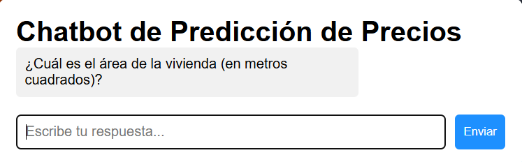

# Chatbot de Predicción de Precios de Viviendas

## Descripción del Proyecto
- Un **chatbot interactivo** para predecir el precio de una vivienda basado en sus características.
- Desarrollado con **Flask** en el backend y **JavaScript** en el frontend.
- Utiliza **Machine Learning** para la predicción de precios de viviendas.
- En lugar de un formulario, el usuario responde preguntas secuenciales en un chat.

## Vista del ChatBot


## Tecnologías Utilizadas
- **Flask** → Backend y API REST.
- **JavaScript** → Interactividad y UX del chatbot.
- **HTML/CSS** → Interfaz gráfica del chat.
- **Pandas, Scikit-Learn** → Manejo de datos y predicciones.
- **Fetch API** → Comunicación entre frontend y backend.

## Instalación y Configuración

### 1. Clonar el Repositorio
```bash
git clone https://github.com/usuario/ChatBot-Housing.git
cd ChatBot-Housing
```
### 2. Crear y Activar un Entorno Virtual
```bash
python -m venv venv
source venv/bin/activate  # Linux/macOS
venv\Scripts\activate  # Windows
```
### 3. Instalar Dependencias
```bash
pip install -r requirements.txt
```
### 4. Ejecutar la Aplicación
```bash
python app.py
```
- La aplicación estará disponible en: **http://127.0.0.1:5000/**

## Estructura del Proyecto
```plaintext
chatbot-prediccion-precios/
│── static/
│   ├── imagenes/   # Imágenes del chatbot
│── templates/
│   ├── index.html  # Interfaz del chatbot
│── styles.css  # Estilos del chatbot
│── model.pkl  # Modelo de Machine Learning
│── train_model.py  # Entrenamiento del modelo de Machine Learning
│── app.py  # Servidor Flask
│── requirements.txt  # Dependencias del proyecto
│── README.md  # Documentación
```

## Interfaz del Chatbot
- **Conversación secuencial**: Preguntas aparecen una por una.
- **Respuestas estilo chat**: Preguntas a la izquierda, respuestas a la derecha.
- **Efecto de escritura**: Simulación de tipeo con `setTimeout()`.
- **Scroll automático**: La conversación se desplaza automáticamente.
- **Predicción visible en el chat**: El resultado se muestra como un mensaje.

## Prompts Claves Usados en el Desarrollo
1. **"¿Cómo puedo convertir respuestas 'Sí'/'No' en valores 1/0 para el modelo?"**
   - Solución: Se usó una conversión en Python (`1 if respuesta.lower() == 'sí' else 0`).
2. **"¿Cómo mostrar respuestas en el lado contrario del chatbot?"**
   - Solución: Se usaron clases CSS diferentes para los mensajes del chatbot y del usuario.
3. **"¿Cómo generar las preguntas con un efecto de escritura?"**
   - Solución: Se implementó un efecto de "typewriter" en JavaScript con `setTimeout()`.
4. **"¿Cómo hacer que el chat haga scroll automáticamente hacia abajo?"**
   - Solución: Se utilizó `chatBox.scrollTop = chatBox.scrollHeight` en JS.
5. **"¿Cómo hacer que la API reciba y procese los datos para predecir el precio?"**
   - Solución: Se definió un endpoint en Flask (`@app.route('/predict', methods=['POST'])`).
6. **"¿Cómo agregar una imagen de fondo al chat?"**
   - Solución: Se agregó `background-image: url('fondo.jpg')` en CSS.

## Mejoras Futuras
- **Agregar validación de entradas** para evitar errores en los datos ingresados.
- **Mejorar la visualización de la predicción** con gráficos.
- **Incluir un sistema de aprendizaje automático en vivo** para mejorar las predicciones con nuevos datos.
- **Hacer el chatbot más conversacional** usando procesamiento de lenguaje natural.

## Autor
- **Sergio Alvarez Herrera** - Desarrollador de la aplicación
- Contacto: Sergioalv1000@gmail.com

## Licencia
Este proyecto está licenciado bajo la **MIT License**. Puedes usarlo y modificarlo libremente.

## Contribuciones
Si deseas contribuir, puedes hacer un **fork** del repositorio, crear una rama, realizar tus cambios y enviar un **pull request**. Toda ayuda es bienvenida.

---
Gracias por revisar este proyecto. ¡Espero que te sea de utilidad!
